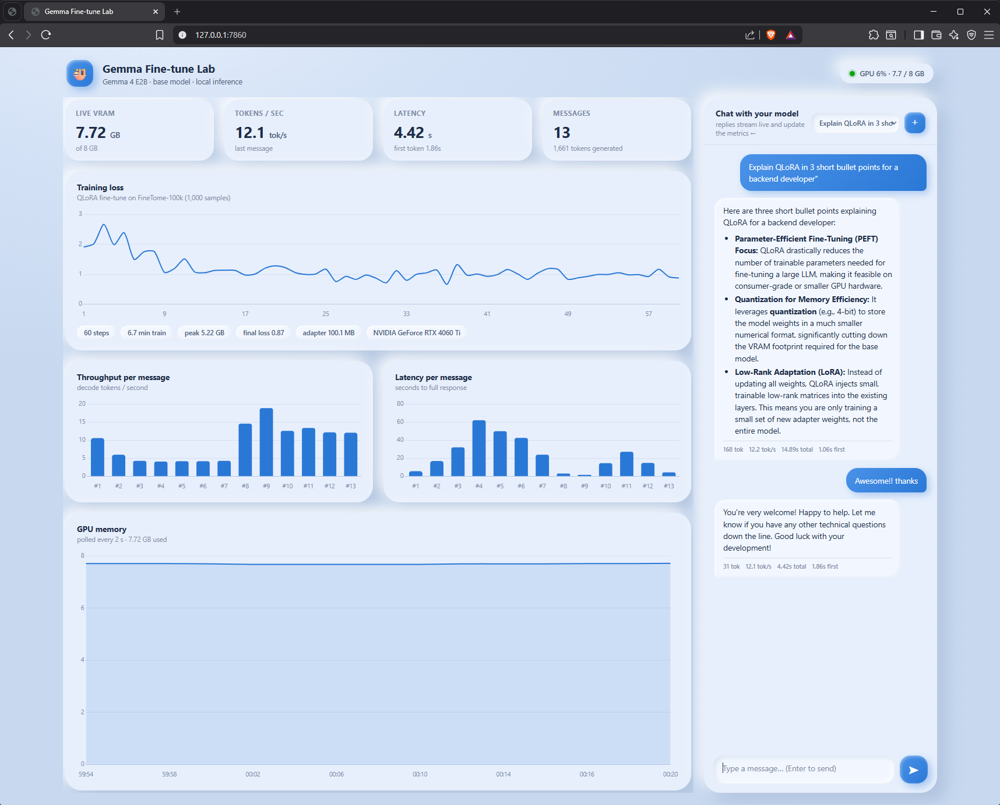

# gemma-8gb-lab

Fine-tuning and running Gemma on an 8GB consumer GPU — actually measured, not
quoted. RTX 4060 Ti, native Windows 11, no cloud.



## Scoreboard

| Test | Result |
|---|---|
| Fine-tune **Gemma 3 4B** (QLoRA) | ✅ 60 steps · **6.7 min** · **5.22 GB** peak · loss 1.91 → 0.87 · 62 MB adapter |
| Run **Gemma 4 E2B** inference | ✅ **7.05 GB** peak · ~15 tok/s — barely fits, apps closed |
| Fine-tune **Gemma 4 E2B** | ❌ 4-bit weights ≈ 7 GB, zero room left for gradients |
| Your desktop's free VRAM | ⚠️ ~2.6 GB gone to browser/Teams before you start. Budget against *free*, not total. |

Receipts: [`results/metrics.json`](results/metrics.json) · before/after generations in [`results/generations.json`](results/generations.json)

## Run it

```powershell
python -m venv .venv && .venv\Scripts\Activate.ps1
pip install torch torchvision --index-url https://download.pytorch.org/whl/cu130
pip install unsloth triton-windows fastapi uvicorn
# unsloth may swap torch for the CPU build — if cuda prints False, reinstall the +cu130 wheel:
python -c "import torch; print(torch.cuda.is_available())"

python finetune_gemma4.py   # ~10 min: train + before/after comparison + metrics
python app.py               # dashboard → http://127.0.0.1:7860
```

The dashboard streams chat replies token-by-token while tokens/sec, latency and
VRAM charts update live. Threads persist across refreshes. Pure Chart.js +
vanilla JS, no build step.

## The 3 Windows traps

1. `pip install unsloth` **silently replaces CUDA torch with the CPU build** → reinstall the `+cuXXX` wheel
2. `dataset_num_proc` **crashes tokenization** on Windows → leave it unset
3. transformers 5.x returns a *string* from `apply_chat_template` → pass `tokenize=True`

(Also: models download to `C:\Users\<you>\.cache\huggingface` by default. Set `HF_HOME` before your C drive finds out.)

## Contributing

PRs and issues welcome — this is a measurement playground, not a product. Ideas
that would genuinely help:

- **Your numbers**: same scripts on a different GPU (3060 12GB? 4070? laptop 4060?) — open an issue with your `metrics.json`
- Make Gemma 4 E2B *training* fit somehow (PLE offload? smaller LoRA target set? prove me wrong)
- An eval set, so "loss went down" becomes "it actually got better"
- Linux/WSL numbers next to the Windows ones
- Dashboard: token-level latency histogram, model switcher, dark clay theme

Keep PRs small and measured — a claim with a number beats a feature without one.

## Caveats

60 steps ≈ 0.24 epochs: this proves the *pipeline*, not model quality. One
machine, one driver, no eval set. MIT licensed. Not affiliated with Google or
Unsloth — just checking a LinkedIn claim with a wattmeter.
